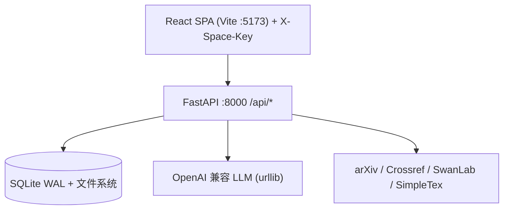

# 文档索引

> 事实源：`docs/_meta.json`（由 `scripts/gen_docs_meta.py` 从代码生成）。手写数字已全部移除，数字以该文件为准。

## 读哪里

| 想做什么 | 看哪里 |
|---|---|
| 架构、分层、生命周期、决策 | [ARCHITECTURE.md](./ARCHITECTURE.md) |
| 表结构、隔离、迁移 | [DATA-MODEL.md](./DATA-MODEL.md) |
| 路由、SSE、curl | [API.md](./API.md)（以 `/docs` OpenAPI 为准） |
| LLM、Agent、上下文、Skills | [AGENT-LLM.md](./AGENT-LLM.md) |
| 前端、路由、状态、设计 | [FRONTEND.md](./FRONTEND.md) |
| 启动、配置、备份、排障 | [OPERATIONS.md](./OPERATIONS.md) |
| 技术债 | [TECH-DEBT.md](./TECH-DEBT.md) |

## 约定

- 空间头 `X-Space-Key`（`trim+lower`），处理器级 `Depends(get_space_id)`，非中间件。
- LLM 调用一律走 `backend/server/llm.py`，禁止 `openai` SDK。
- 数字（表/路由/Hub/版本）以 `_meta.json` 为准，文档不手写。
