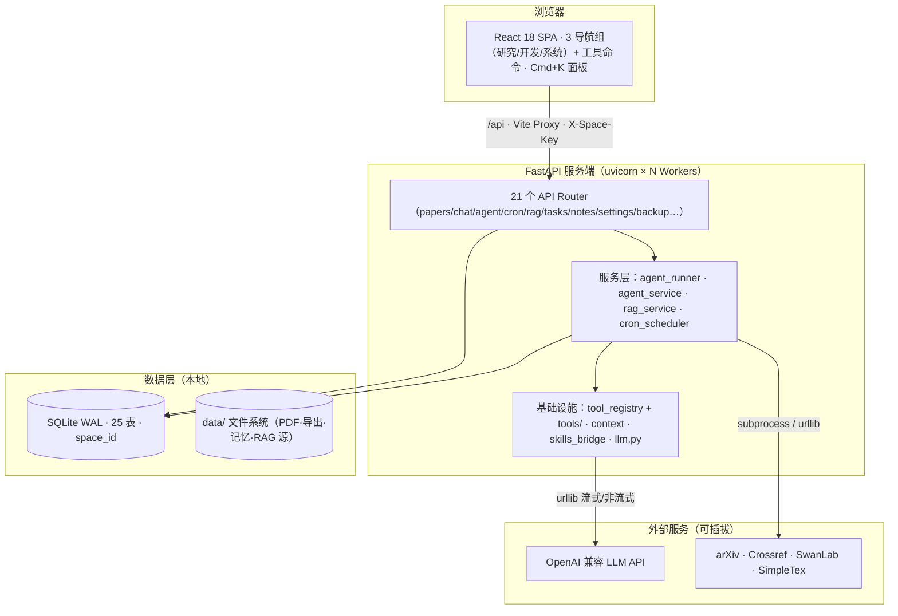
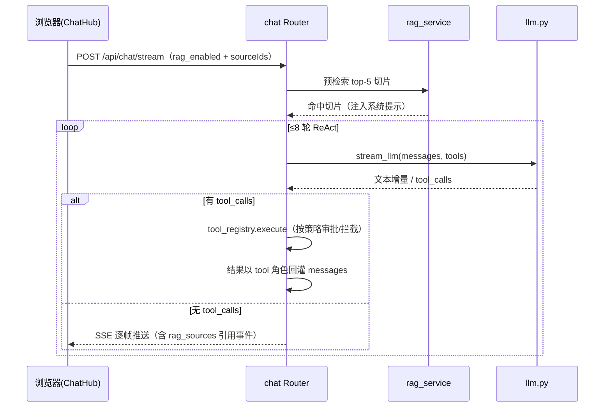

# 系统设计文档（架构图 + 核心模块 + 数据流）

> 本文是 AI-Research-OS 的**一页看懂式综合设计文档**，基于代码实况整理（核对日期：2026-08-24）。
> 深入细节请查阅专题文档：[ARCHITECTURE](./ARCHITECTURE.md) · [API](./API.md) · [DATA-MODEL](./DATA-MODEL.md) · [AGENT-LLM](./AGENT-LLM.md) · [FRONTEND](./FRONTEND.md) · [OPERATIONS](./OPERATIONS.md)

---

## 1. 系统定位与硬约束

面向研究生与科研工作者的一站式 AI 研究与开发工作台：论文管理、知识笔记、任务、实验追踪、对话与多 Agent 协作全部落在本机，LLM 能力可插拔（不配置 LLM 时 CRUD 与检索照常工作）。

| 硬约束 | 落地方式 |
|---|---|
| **本地优先** | 单文件 SQLite（WAL）+ `data/` 目录，整体拷贝即迁移 |
| **零重依赖** | LLM 客户端用标准库 urllib 手写（禁 `openai` SDK）；后端 pip 依赖极少；前端 shadcn 源码内置 |
| **不登录多人可用** | space-key 软隔离：`X-Space-Key` 请求头分空间，无账号 / 密码 / session |

## 2. 技术栈

| 层 | 技术 | 说明 |
|---|---|---|
| 前端 | React 18 + TypeScript + Vite 5 | 路由级懒加载（11 个 Hub 全部 lazy） |
| | TailwindCSS + shadcn/ui（源码内置） | 无额外 UI 库 |
| | Zustand + React Router v6 | 按 Hub 拆分 store |
| 后端 | FastAPI + uvicorn（多 Worker） | `backend.server.main:app`，端口 8000 |
| | aiosqlite + SQLite WAL | 每请求独立连接，多进程安全 |
| | SSE | Agent 与 Chat 均为 SSE，但使用不同事件类型与前端状态机 |
| 存储 | SQLite + 文件系统 | 26 张业务表全带 `space_id`；`data/<module>/<space_id>/` |

## 3. 系统架构总览



**进程模型**：开发态 Vite（:5173）反代 `/api`；生产态 uvicorn 直接托管 `frontend/dist`。多 Worker 之间**不共享内存**——一切运行状态（Agent 进度、审批、cron 抢锁）都落 SQLite，天然跨 Worker 可见。

## 4. 核心模块

### 4.1 前端（`frontend/src/`）

- **导航单一数据源**：`config/navigation.ts` 的 `navGroups`（研究 / 开发 / 系统 3 组 6 个一级导航）+ `toolCommands`（公式 / 引用 / 任务 / 运行历史 / 定时）+ `commandGroups`（Cmd+K 命令面板）。
- **信息架构规则**：有独立数据模型 → 业务域进侧边栏；无独立数据模型 → 工具命令 + 嵌入所属业务域（如公式嵌入知识库、引用嵌入论文中心）。
- **API 层**：`services/apiMonitor.ts` 单点注入 `X-Space-Key`，并用真实 `/api` 流量驱动侧边栏后端状态灯（取代 healthz 轮询）。
- **常驻组件**：`GenerationWatcher`（后台 Agent 完成巡查 + toast 提醒）、`SpaceGate`（首屏空间引导）、`ChatPanel`（全局对话浮层）。

### 4.2 后端横切层（`backend/server/`）

| 模块 | 职责 |
|---|---|
| `main.py` | FastAPI 入口：CORS → 统一异常处理 → 挂载 21 个 Router → lifespan（`init_db` + 启动 cron 调度器）→ 生产态托管 SPA |
| `config.py` | pydantic-settings 单例；在导入 `database.py` **之前**写 `DATA_DIR` 环境变量保证路径一致；兼容旧 `/v1` 双写配置 |
| `deps.py` | `get_space_id` 处理器级依赖：解析 `X-Space-Key`（trim + lower，最短 4 字符），系统级接口豁免 |
| `errors.py` | 统一错误体 `{success, error, message}` + SSE 错误辅助 |

### 4.3 LLM 客户端（`llm.py`，零依赖）

urllib 手写的 OpenAI 兼容客户端，全局单例 `llm_client`：

- `call_llm()` 非流式，**任何失败返回 `None`，调用方优雅降级**；
- `stream_llm()` SSE 流式 + 原生 function calling：yield 文本增量，流结束后至多 yield 一个 `{"tool_calls": [...]}`（跨 delta 增量拼接参数）；
- `embed()` 走 `{base}/embeddings`（RAG 用），失败降级关键词检索；
- 端点 = `{LLM_BASE_URL}{LLM_HTTP_PATH}`，Base URL 含 `/v1`（OpenAI SDK 约定）。

### 4.4 Agent 体系（本项目工程化核心）

| 模块 | 职责与关键机制 |
|---|---|
| `agent_service.py` | 角色化管线真身：architect → planner → developer → reviewer，由 `agent_roles.json` 配置驱动（改配置不改代码）。每角色 = system prompt + 可选结构化解析器；角色内 ReAct 循环（LLM 流式 → 工具调用 → 结果回灌，≤8 轮） |
| `agent_runner.py` | 后台非阻塞 runner：`submit_run` 落库即返回 run_id，执行搬进守护线程（线程内自建事件循环跑 aiosqlite）。**双层取消**：同 Worker 内存 `threading.Event`，跨 Worker 读 DB 状态 |
| `tool_registry.py` | 插件化工具注册表：`@register_tool` 装饰器 + `tools/` 目录 pkgutil 自动发现（新增工具零改动主循环）。**三级策略**：safe / sensitive / dangerous × auto / manual / strict 审批模式，dangerous 非 strict 一律拦截（fail-closed） |
| `tools/` | 内置工具：`core_tools.py`（笔记/任务等写库工具）+ `code_exec.py`（subprocess 沙箱执行 LLM 生成代码） |
| `context.py` | 共享上下文管理：CJK 加权 token 估算 → 超预算把早期历史 LLM 压缩成摘要（切分点选在 user 边界，**不破坏 assistant(tool_calls) 与 tool 结果配对**） |
| `skills_bridge.py` | SKILL.md 目录式技能发现 + subprocess 调用，与注册表工具在 `get_tools()` 合并 |

**三类内部事件**（`__` 前缀，仅 runner 消费）：`__approval_required`（审批暂停，`gen.send(decision)` 回传决策）、`__replay`（每轮完整消息序列落库 → 可重放日志）。

### 4.5 RAG 子系统（2026-08-19 落地）

- `rag_service.py`：文件发现（PDF/TXT/MD，pypdf 可选依赖）→ 递归字符切片（记录页码与区间）→ 批量嵌入（复用 LLM 的 `/v1/embeddings`，失败**自动降级词频检索**）→ 余弦检索 → 带引用回答；
- `rag_runner.py` 后台索引线程；`routers/rag.py` 9 个管理端点；
- **Chat 接地**：`ChatRequest.rag_enabled` 预检索 top-5 注入系统提示，SSE 推 `rag_sources` 引用事件；RAG 配置按会话持久化在 `conversations.metadata`。

### 4.6 Cron 调度器（2026-08-23 落地）

- 自研零依赖 cron 解析器（5 字段 + daily/weekly/hourly 快捷词），不引入 croniter；
- 每 Worker 一个 daemon 线程，60s 扫描 `cron_jobs`，**乐观锁防重**：`UPDATE ... WHERE last_run < next_run` 靠 rowcount 抢锁，多 Worker 只有一个执行；
- 三种 job_type：`command`（subprocess）/ `agent_run`（触发 Agent 管线）/ `arxiv_fetch`（抓论文落库）；历史写 `cron_run_history`。

### 4.7 数据层（`scripts/database.py`）

- **26 张业务表**全带 `space_id`；其中 25 张纳入通用幂等迁移，`cron_run_history` 在 DDL 中原生包含该列。存量数据归 `__default__`，子表反范式写父空间；
- 连接纪律：aiosqlite 每请求独立连接（绝不跨协程共享），建连即设 `busy_timeout=5000` → `journal_mode=WAL` → `synchronous=NORMAL`，锁竞争有限重试；
- 更新语义：写操作返回 `rowcount > 0`，不跨空间误报成功。

## 5. 核心数据流

### 5.1 常规 CRUD（以创建任务为例）

```
浏览器 fetch('/api/tasks', {method:'POST', headers:{'X-Space-Key':...}})
  → Vite Proxy → FastAPI tasks Router
  → Depends(get_space_id) 解析空间（缺失/过短 → 400）
  → database.py 按 space_id 打标写入 SQLite(WAL)
  → {success:true, data:...} 响应
```

### 5.2 Chat ReAct + RAG 接地（SSE 流）



### 5.3 Agent 后台运行管线（SSE / 轮询）

即前文流程图：提交（立即返回 run_id）→ 守护线程逐角色执行（上游 raw_output = 下游输入）→ 角色内 ReAct（审批暂停 / 上下文压缩 / 重放日志）→ 事件逐帧落库（`agent_runs` / `agent_run_events` / `agent_replay_messages` / `agent_tool_approvals`）→ 前端 `GET /runs/{id}` 轮询或 SSE 订阅 → `GenerationWatcher` 完成提醒。

关键点：**审批是生成器暂停语义**——`run_role` yield `__approval_required` 后挂起，runner 落 pending 审批行并轮询 DB 等用户点击，`gen.send(bool)` 回传后继续；无决策者 / 超时 / 取消一律按拒绝（fail-closed）。

### 5.4 Cron 定时任务

```
各 Worker daemon 线程每 60s 扫描 cron_jobs
  → 乐观锁抢任务（rowcount=1 者执行）
  → 按 job_type 分派：
     command → subprocess（继承 SPACE_ID/DATA_DIR 环境变量）
     agent_run → agent_runner.submit_run（进入 5.3 管线）
     arxiv_fetch → fetch_arxiv.fetch_papers 落库
  → 结果写 cron_run_history，重算 next_run
```

## 6. 关键设计决策

| 决策 | 理由 |
|---|---|
| LLM 用 urllib 手写而非 openai SDK | 零重依赖约束；端点/鉴权/流式协议完全可控 |
| Agent 执行放守护线程而非 asyncio 任务 | `run_full_workflow` 是同步生成器（urllib 同步 IO），直接进协程会卡死事件循环；线程内自建事件循环跑 DB |
| 运行状态全落 SQLite 而非内存 | 多 Worker 无共享内存，DB 为准 → 跨 Worker 可见 / 可取消 / 重启不丢 |
| 审批用生成器 `send()` 而非回调 | 保持 `run_role` 单生成器控制流，暂停/恢复语义清晰 |
| 上下文压缩而非轮次截断 | 截断会切断 tool 配对导致 API 报错；摘要保留语义且切分点选 user 边界 |
| cron 乐观锁而非分布式锁 | SQLite `UPDATE rowcount` 原子性足够，零新增依赖 |
| 工具 `@register_tool` + 目录自动发现 | 新增工具零改动主循环；策略（safe/sensitive/dangerous）随注册声明 |
| 前端路由全部 lazy | 11 个 Hub 代码分割，缩小首屏包体 |

## 7. 部署形态

- **开发**：`start.ps1` / `start.sh` 一键起后端（多 Worker）+ 前端 Vite；
- **生产**：`npm run build` 后 uvicorn 单端口托管 `frontend/dist`（StaticFiles, html=True），`/api/*` 路由优先于 SPA 挂载；
- **多人内网**：同一部署 + 不同 `X-Space-Key` 即软隔离共享。

## 8. 快速索引

| 想做什么 | 看哪里 |
|---|---|
| 加一个 API 端点 | `backend/server/routers/`（记得 `space_id` 过滤 + 注册进 `__init__.py`） |
| 加一个 Agent 工具 | `backend/server/tools/<name>.py` + `@register_tool(policy=...)` |
| 加/调/关一个角色 | `backend/agent_roles.json`（无需改代码） |
| 加一张表 | `scripts/database.py`（DDL 原生写 `space_id`；需兼容旧表时加入 `SPACE_TABLES`） |
| 加一个 Hub | `frontend/src/hubs/<name>/` + `navigation.ts` 注册 + `App.tsx` 懒加载路由 |
| 加一个定时任务类型 | `cron_scheduler.py` 的分派逻辑 |
